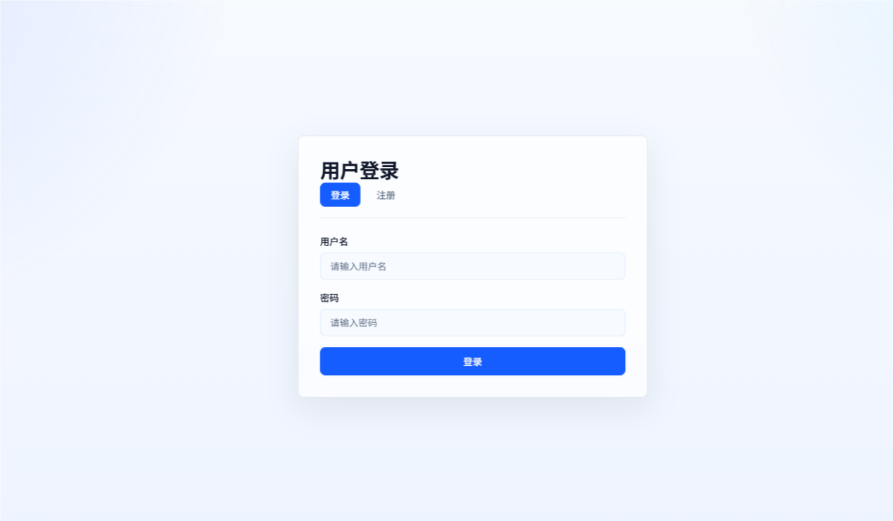
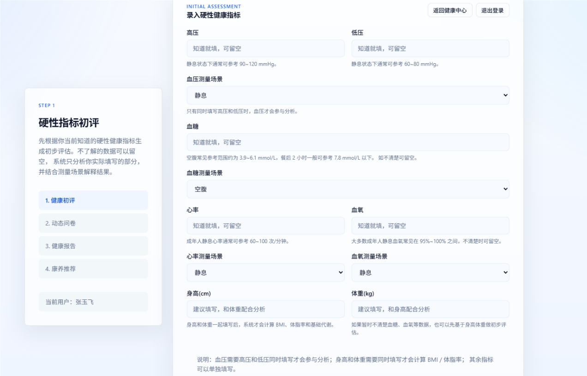
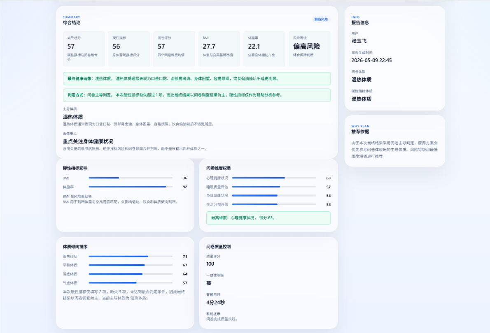
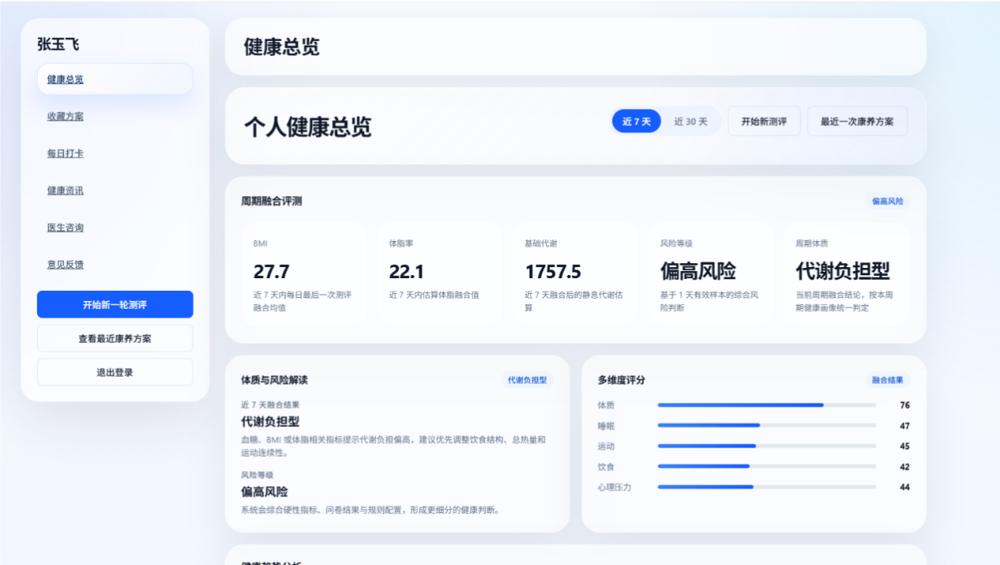
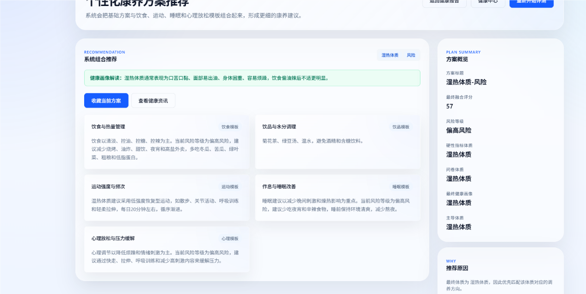
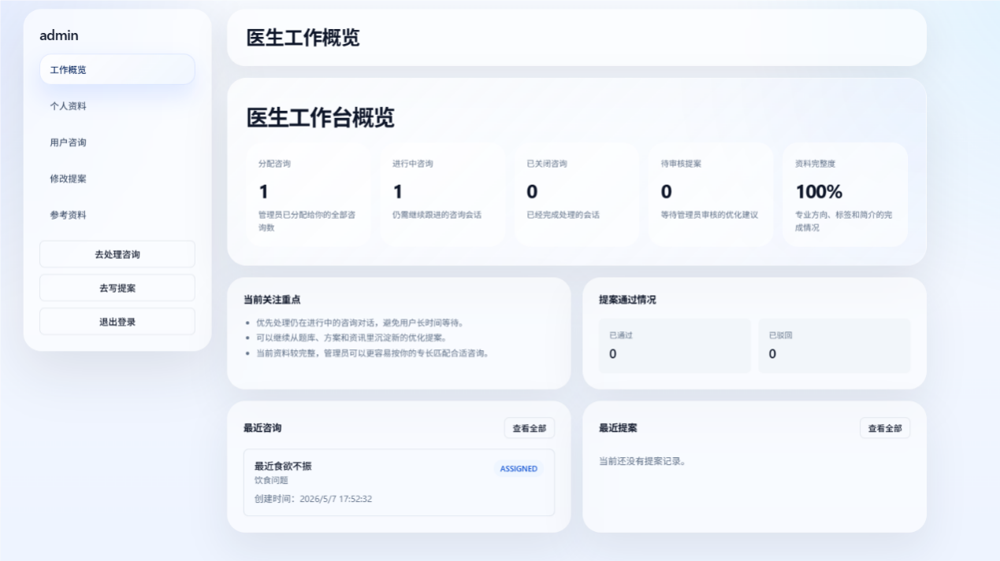
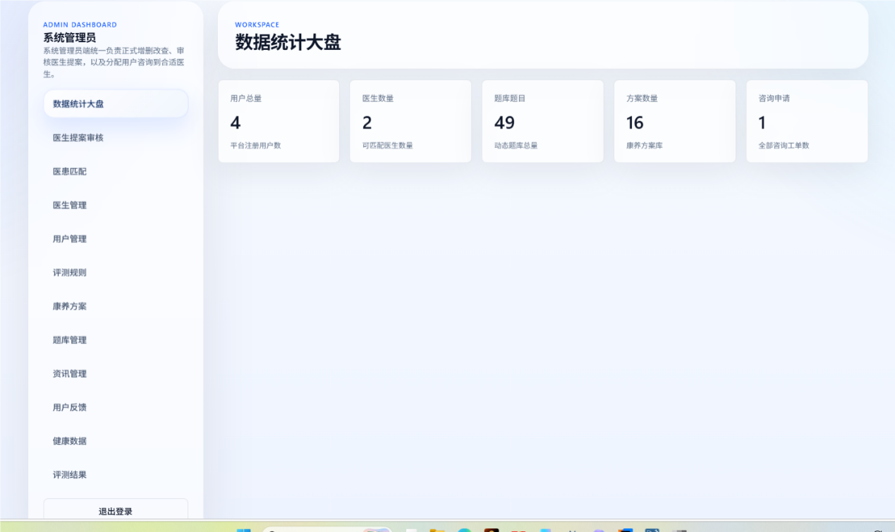
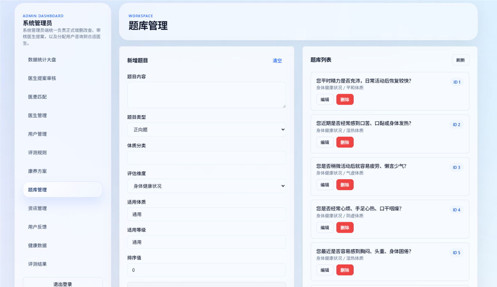
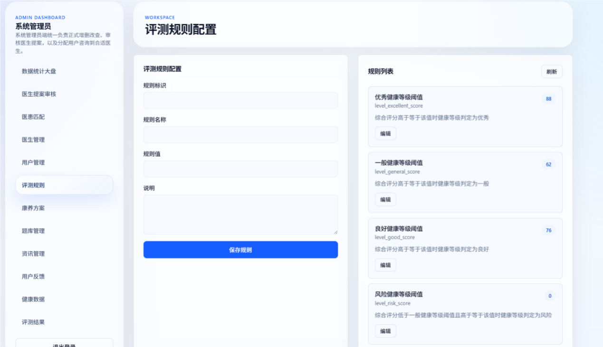

# 人体健康评测与康养系统

本项目是大学阶段毕业设计《人体健康评测与康养系统的设计与实现》的完整工程代码。系统围绕“健康数据采集、问卷测评、综合评估、康养方案推荐、每日打卡、医生咨询、后台维护”这条业务链路展开，面向普通用户、医生和系统管理员三类角色提供不同的操作入口。

项目采用前后端分离的 B/S 架构：后端基于 Spring Boot 实现接口和评测逻辑，前端基于 Vue 3 构建用户端、医生端和管理员端页面，数据库使用 MySQL 保存用户健康数据、问卷题目、评测结果、康养方案、咨询记录和后台配置。

## 项目截图

### 登录与角色入口



### 用户端：健康指标录入



### 用户端：综合评测报告



### 用户端：健康总览



### 用户端：个性化康养方案



### 医生端：工作概览与咨询处理




### 管理员端：后台管理







## 功能概述

### 普通用户端

- 用户注册、登录。
- 录入血压、血糖、心率、血氧、身高、体重等硬性健康指标。
- 完成动态问卷测评，系统根据体质倾向和健康等级推荐题目。
- 查看综合评分、健康等级、风险等级、体质倾向和解释说明。
- 查看饮食、饮水、运动、生活方式等康养方案。
- 每日打卡，记录睡眠、运动、压力、心情、体重和备注。
- 浏览健康资讯，收藏康养方案。
- 发起医生咨询，查看咨询消息。
- 提交意见反馈。

### 医生端

- 医生注册、登录。
- 查看工作概览、分配咨询、近期提案等信息。
- 查看用户只读健康快照，辅助咨询回复。
- 处理用户咨询并发送消息。
- 查看参考题库、康养方案和健康资讯。
- 提交题库、方案、资讯等内容修改提案。

### 管理员端

- 管理员登录。
- 查看用户数量、医生数量、题库题目数量、方案数量和咨询申请数量。
- 管理用户、医生、题库、康养方案、健康资讯、评测规则。
- 查看健康数据和评测结果。
- 审核医生提交的内容修改提案。
- 分配用户咨询给合适医生。
- 查看用户反馈和系统日志。

## 核心业务流程

系统的核心流程可以概括为：

```text
用户录入健康指标
        ↓
系统生成硬性指标初评
        ↓
根据体质和健康等级推荐问卷题目
        ↓
用户完成问卷作答
        ↓
融合硬性指标和问卷结果
        ↓
生成健康等级、风险等级和体质画像
        ↓
匹配康养方案并支持持续打卡跟踪
```

## 核心评测逻辑

系统评测由硬性指标和问卷评测两部分组成。

硬性指标部分主要参考血压、血糖、心率、血氧、BMI、体脂率等指标。不同指标设置不同权重，系统会先计算单项指标分数，再按权重计算综合得分。

问卷部分按照身体健康状况、生活习惯评估、心理健康状况、睡眠质量评估四个维度组织题目。系统会根据用户前一次健康数据形成的体质倾向和健康等级，从题库中优先选取更匹配的题目，同时保证多个维度都被覆盖。

最终结果会输出：

- 综合得分。
- 健康等级。
- 风险等级。
- 体质倾向。
- 多维度评分。
- 康养方案推荐原因。
- 饮食、饮水、运动、作息和心理放松建议。

## 技术栈

| 层级 | 技术 |
| --- | --- |
| 后端 | Java 17、Spring Boot、Spring Data JPA |
| 前端 | Vue 3、Vue Router、Vite |
| 数据库 | MySQL |
| 架构 | B/S 架构、前后端分离 |
| 数据交互 | RESTful API、JSON |

## 项目结构

```text
health-system
├─ backend                 # Spring Boot 后端
│  ├─ src                  # 后端源码
│  ├─ sql                  # 原项目扩展 SQL
│  ├─ pom.xml              # Maven 配置
│  └─ mvnw.cmd             # Maven Wrapper
├─ user-frontend           # 用户端与医生端 Vue 前端
│  ├─ src
│  ├─ package.json
│  └─ vite.config.js
├─ admin-frontend          # 管理员端 Vue 前端
│  ├─ src
│  ├─ package.json
│  └─ vite.config.js
├─ database
│  ├─ schema.sql           # 建库、建表和基础演示数据
│  ├─ feature-extension.sql
│  └─ TABLES.md            # 数据库表说明
├─ docs
│  └─ images               # README 使用的系统截图
├─ .gitignore
└─ README.md
```

## 数据库初始化

MySQL 数据库本身不能直接上传到 GitHub，因此项目中提供了 SQL 脚本。

### 方式一：命令行导入

先确认 MySQL 服务已经启动，然后执行：

```bash
mysql -u root -p < database/schema.sql
```

执行后会自动创建数据库：

```text
health_system
```

### 方式二：图形化工具导入

也可以使用 Navicat、DataGrip 或 MySQL Workbench：

1. 打开 `database/schema.sql`。
2. 连接本地 MySQL。
3. 全选 SQL 内容并执行。
4. 确认生成 `health_system` 数据库和相关数据表。

### 默认演示账号

| 角色 | 用户名 | 密码 |
| --- | --- | --- |
| 普通用户 | `testuser` | `123456` |
| 医生 | `doctor` | `123456` |
| 管理员 | `admin` | `123456` |

## 后端启动方式

进入后端目录：

```bash
cd backend
```

如果你的 MySQL 用户名和密码不是默认值，可以在启动前设置环境变量，或者修改：

```text
backend/src/main/resources/application.yml
```

当前配置支持环境变量：

```yaml
username: ${DB_USERNAME:root}
password: ${DB_PASSWORD:root}
```

启动后端：

```bash
mvn spring-boot:run
```

如果没有全局 Maven，可以使用 Maven Wrapper：

```bash
mvnw.cmd spring-boot:run
```

后端默认端口：

```text
http://localhost:8080
```

## 用户端和医生端启动方式

进入用户端目录：

```bash
cd user-frontend
```

安装依赖：

```bash
npm install
```

启动：

```bash
npm run dev
```

默认访问地址：

```text
http://localhost:5173
```

该前端包含普通用户入口和医生入口：

- 普通用户：`/user/auth`
- 医生：`/doctor/auth`

## 管理员端启动方式

进入管理员端目录：

```bash
cd admin-frontend
```

安装依赖：

```bash
npm install
```

启动：

```bash
npm run dev
```

默认访问地址：

```text
http://localhost:5174
```

管理员登录页面：

```text
http://localhost:5174/admin/auth
```

## 运行顺序

建议按下面顺序启动：

1. 启动 MySQL。
2. 执行 `database/schema.sql` 初始化数据库。
3. 启动后端 `backend`。
4. 启动用户端 `user-frontend`。
5. 启动管理员端 `admin-frontend`。
6. 使用默认账号登录并测试主要功能。

## 主要接口模块

| 模块 | 接口前缀 | 说明 |
| --- | --- | --- |
| 用户登录注册 | `/user` | 普通用户注册、登录。 |
| 健康指标 | `/health` | 健康数据提交和初评。 |
| 问卷测评 | `/question` | 题目列表、推荐题目、提交问卷。 |
| 用户中心 | `/user-center` | 健康总览、资讯、收藏、打卡、反馈、咨询。 |
| 医生端 | `/doctor` | 医生登录、咨询处理、健康快照、提案提交。 |
| 医生题库查看 | `/doctor/questions` | 医生只读查看题库。 |
| 管理员端 | `/admin` | 用户、医生、题库、方案、资讯、规则、提案和咨询管理。 |

## GitHub 上传说明

如果你使用 GitHub 网页上传，建议上传 `D:\86195\github_projects\health-system` 目录中的全部内容。

应该上传：

```text
backend
user-frontend
admin-frontend
database
docs
.gitignore
README.md
```

不要上传：

```text
node_modules
dist
target
.idea
.npm-cache
.env
```

仓库创建时建议：

- 仓库名称：`health-system`
- 可见性：`Public`
- 不勾选 GitHub 自动生成 README，因为本项目已经包含 README。
- `.gitignore` 可以选择“没有”，因为本项目已经提供 `.gitignore`。

## 项目说明

本系统目前主要用于毕业设计展示和本地运行演示。评测规则基于预设阈值、问卷分值和权重融合方式实现，适合展示健康数据采集、健康画像生成、康养方案推荐和多角色协作流程。后续如果继续完善，可以扩展移动端适配、智能推荐模型、更加细致的权限控制、数据可视化和真实部署配置。
